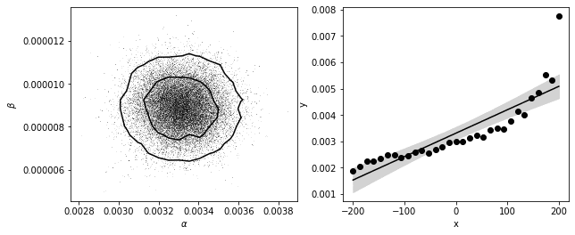

Bayesian statistics is used to determine a favourable model for the charge flow across defects in graphene. Following this, R is used to perform non-linear regression to fit to experimental data and extract fitting statistics.

