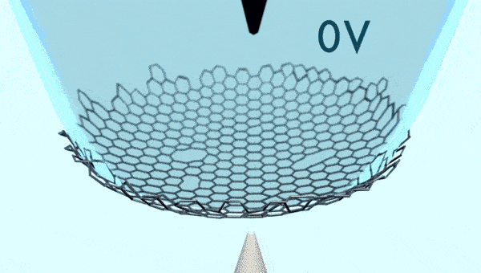
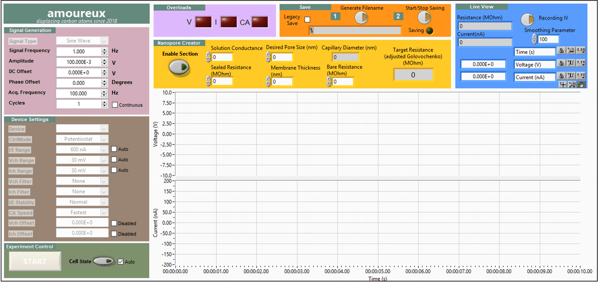

Perforating graphene has many applications, ranging from ionic transport to single-molecule sensing. In particular, we are interested in displacing a sufficient number of carbon atoms from graphene to create pores of 5 nm and above, allowing the passage of DNA through such pores to be sensed.

