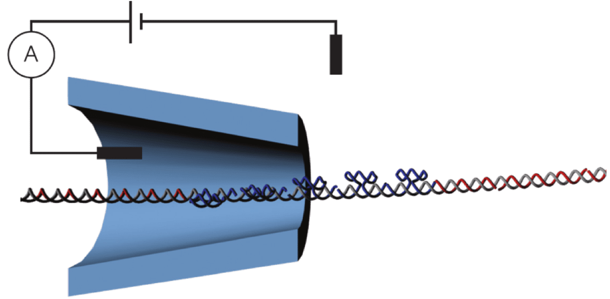
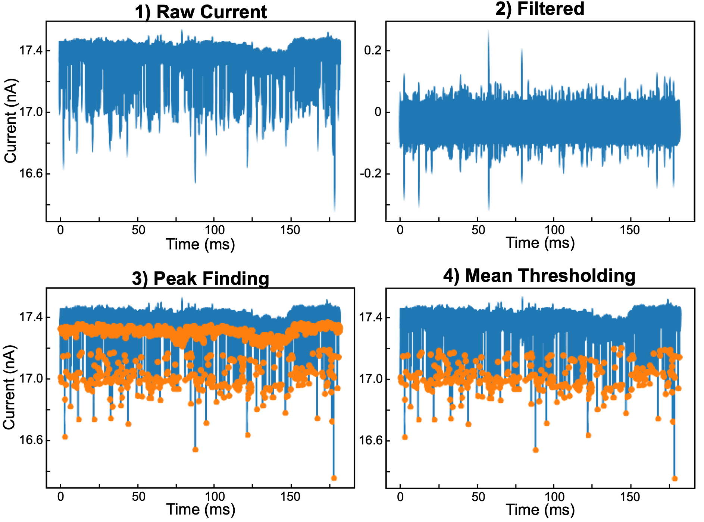
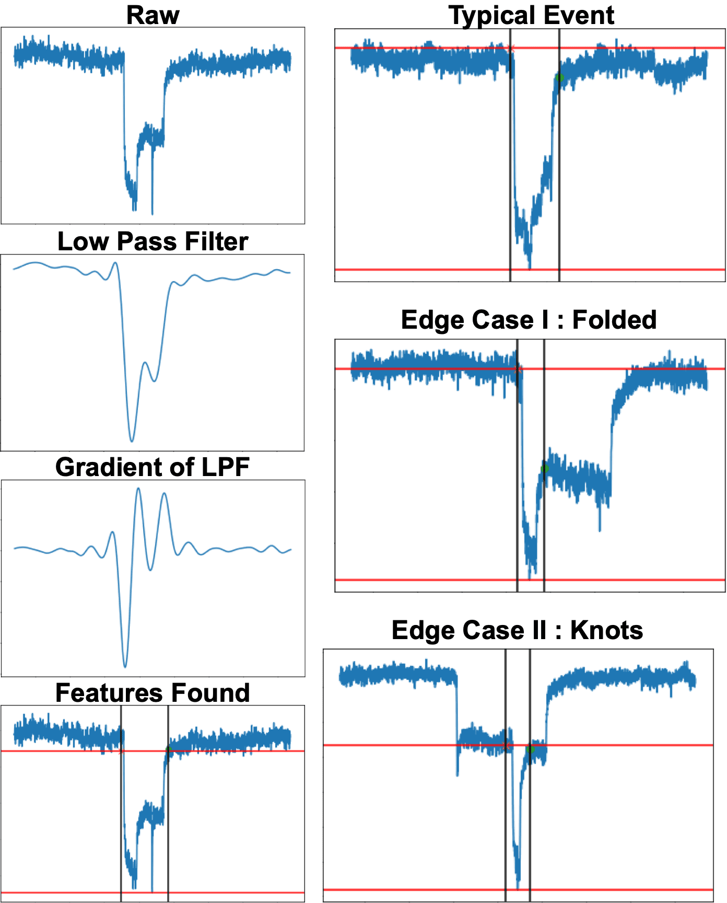
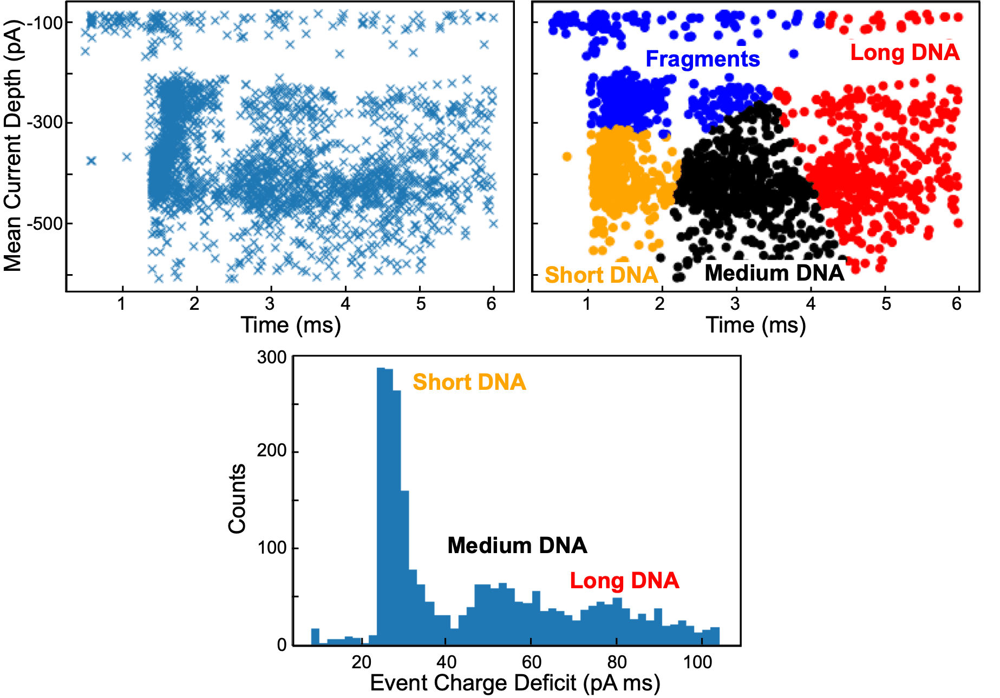

DNA translocation through nanopores can be studied by applying a voltage and measuring the current — 'resistive pulse sensing'. In order to increase the resolution of such systems, nanopores in 2D membranes could be used; however, these are inherently noisy. With many terabytes of noisy data, a trained CNN could be used to detangle the translocations from the noise.

