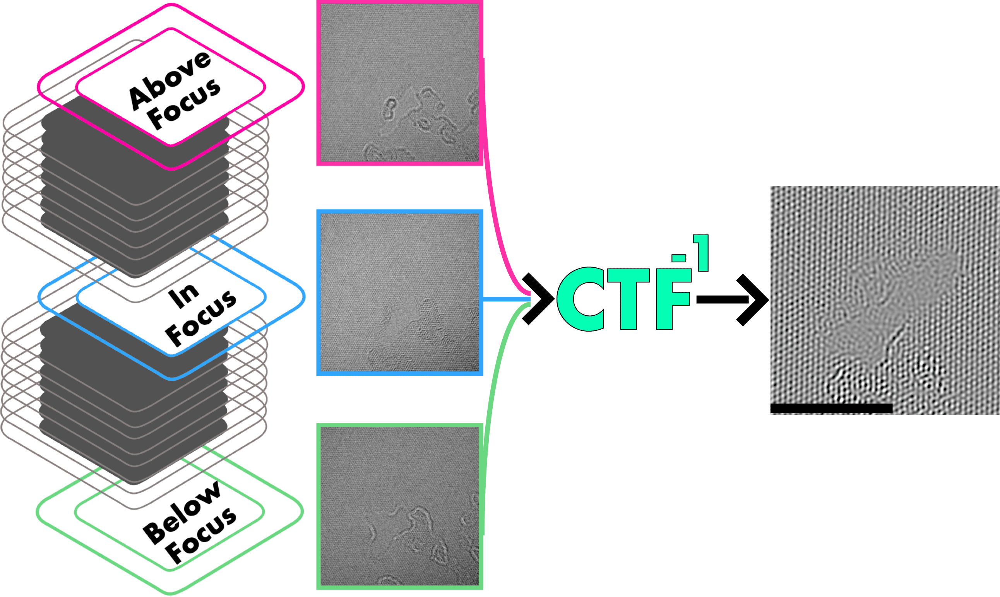
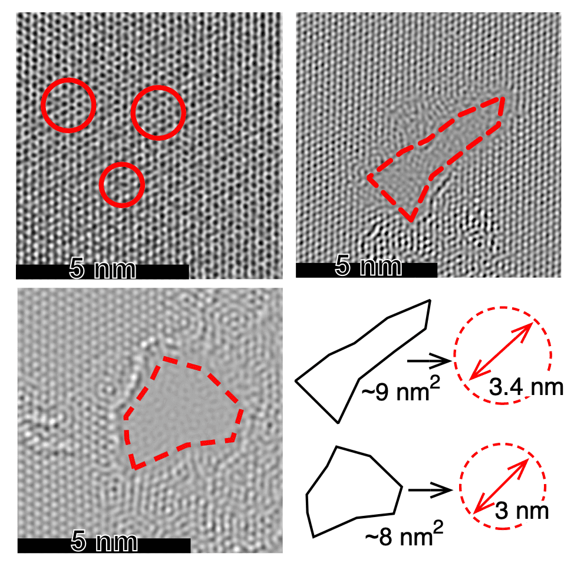

Since the majority of my work involves 2D materials, studying the surface morphology and defects within the materials is important. I use Raman spectroscopy to infer some of the properties within the material, such as how many layers I am working with or how many holes or defects the material has, but imaging the surface morphology and defects within the material can be far more useful and convincing.

The highest resolution we can obtain using an optical microscope is around 200 nm; using electrons instead of photons can greatly improve this resolution. With the scanning electron microscopes (SEM) that we have in Cambridge, we can bring this limit closer to 20 nm. An SEM will use, mostly, surface-scattered electrons for detection, but by using electrons that penetrate through the sample, the resolution can be improved further. Transmission electron microscopy (TEM) does just that, and approaches resolutions close to 0.5 nm. This resolution is predominantly hampered by aberrations within the microscope lenses. If these aberrations are corrected for, the theoretical information limit from TEM approaches 42 pm (0.04 nm).

With knowledge of the microscope imaging conditions and the aberration factors, the contrast transfer function (CTF) can be found. This function describes the degrading factors imposed on the final image seen. By applying the inverse of this function to the image, we can get back the 'true', aberration-corrected image. Therefore, the more accurate the CTF, the better the resolution of the image which can be reconstructed.

The CTF is obtained iteratively and requires a focal series of images, since the function is sensitive to phase.

## Reference

Caglar, M., Pandya, R., Xiao, J., Foster, S., Divitini, G., Chen, R., Greenham, N., Franze, K., Rao, A. and Keyser, U. All-Optical Detection of Neuronal Membrane Depolarization in Live Cells Using Colloidal Quantum Dots. *Nano Letters*. [doi:10.1021/acs.nanolett.9b03026](https://doi.org/10.1021/acs.nanolett.9b03026)
