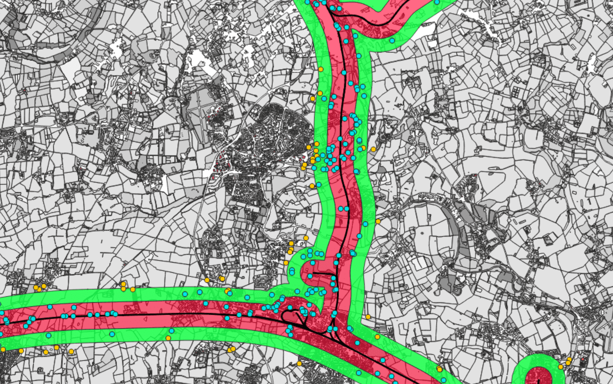
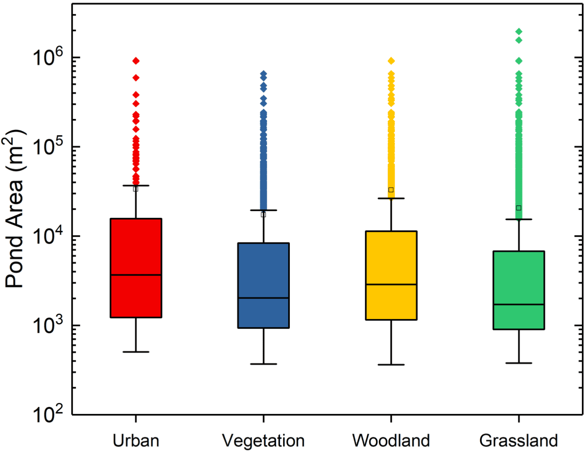
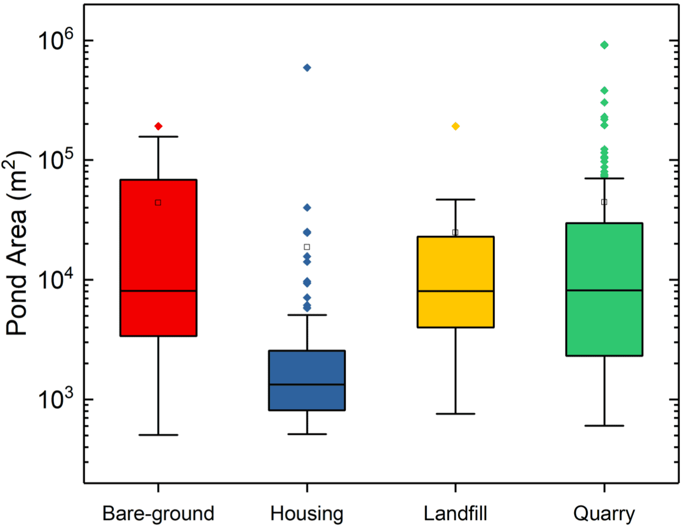
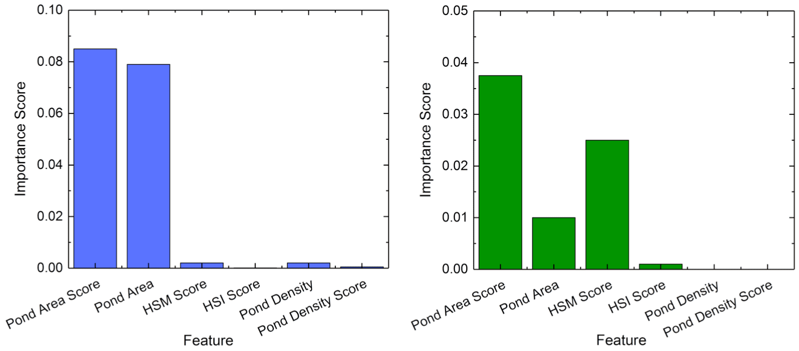
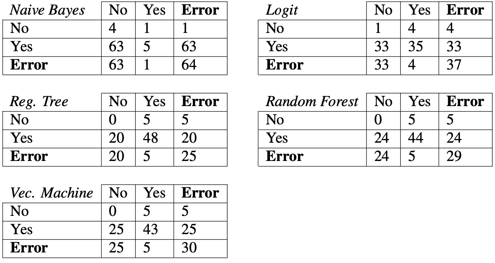

As a protected species, knowledge of the extent and distribution of habitats of the great crested newt (GCN) is of paramount importance within both the rail and construction sectors. Using data sourced from Network Rail, I apply an adjusted 10-point scale (Oldham et al.) to determine the likelihood of areas being occupied by GCNs — alleviating the need for costly site visits.





## Results

| | Pond count | Inhabited ponds | GCN sightings within 300 m | Share of all GCN recordings |
|---|---:|---:|---:|---:|
| Score < 0.6 | 161 | 0% | 50 | 1% |
| Score ≥ 0.6 | 7863 | 6% | 3031 | 91% |

Ponds were scored with the habitat suitability index of Oldham et al. using the factors that were available: pond area, pond density and terrestrial habitat. Ponds scoring 0.6 or more are deemed suitable for great crested newts; 6% of them have recorded sightings, which make up 91% of all available recordings.




