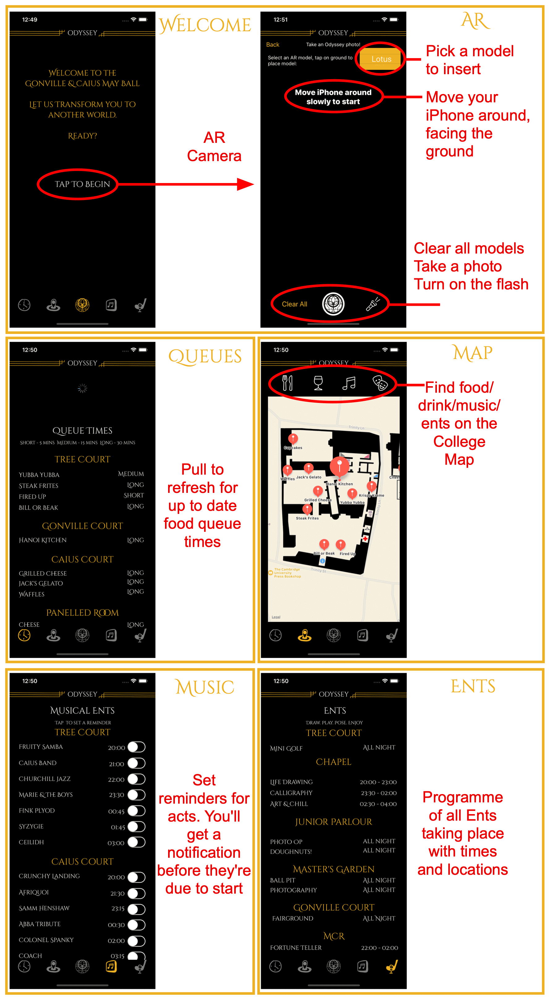
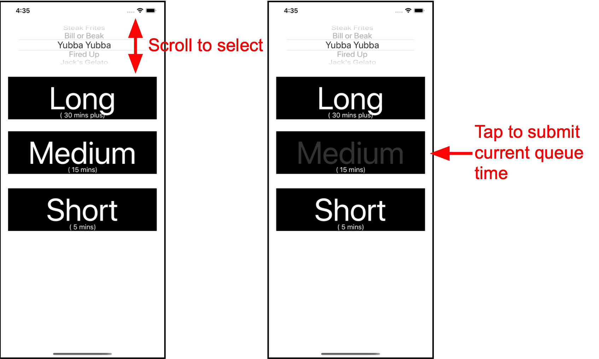

My first app on the iOS App Store — the companion app to the Gonville & Caius May Ball. Over 4,000 impressions and 600 downloads in the first week.

Gonville and Caius is a constituent college of the University of Cambridge and as such holds a [May Ball](https://en.wikipedia.org/wiki/May_Ball_in_Cambridge) every two years. As the *Systems President*, I created the May Ball website, which had a managed queue and ticketing system to handle purchases. As well as handling ticketing, the website displayed queue times and an interactive programme. For guests with iOS devices, I created an iOS app.

Written in Swift, the app used MapKit for an interactive map of the college grounds and ARKit for an AR photo-taking experience with themed 'props'. A companion app for committee members allowed queue time uploads, giving app users live queue updates. Static features such as the programme were made interactive with customisable push notification reminders. Below is a walkthrough of the app.

